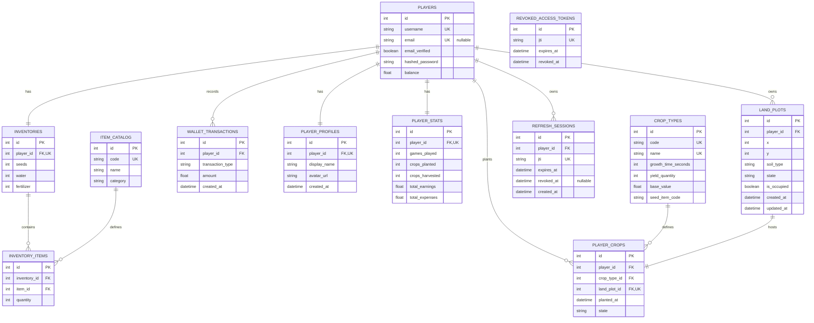

# Database Diagram

Source of truth: [`app/models.py`](../app/models.py)

## Notes

- Database configured in [`app/database.py`](../app/database.py) uses SQLite: `sqlite:///./freefarm.db`.
- `inventory_items` has a composite uniqueness rule on `(inventory_id, item_id)`.
- `land_plots` has a composite uniqueness rule on `(player_id, x, y)`.
- `revoked_access_tokens` is intentionally standalone and does not reference `players`.
